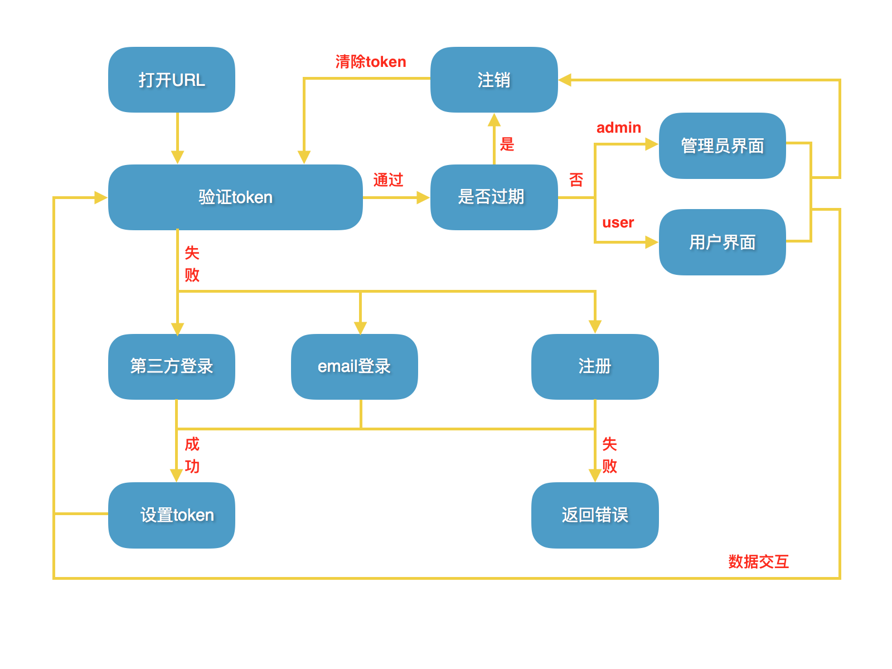
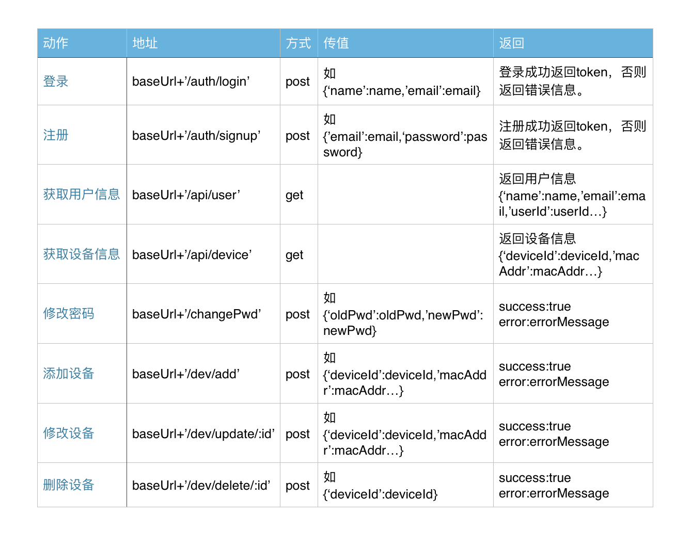
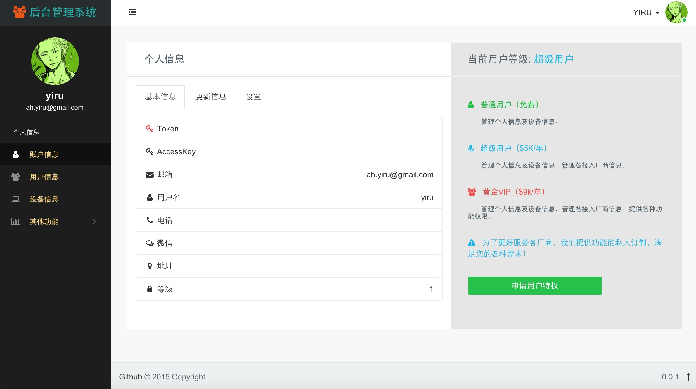

# IoT-Dashboard

##  基于mongodb+nodejs+angular的云管理系统

## 系统设计

#### 1.框架选择：`jquery`、`bootstrap` [备选：`angular/backbone`（MVC架构）、`material design lite`（界面设计）、`express`（node后端）]

* `jquery`是一个`js`库，里封装了很多功能，我们可以直接拿来用。`bootstrap`是一个`css`框架，里面包含了丰富的组件。这二者都方便了开发者，让web开发更加迅速、简单。

* MVC选择：之前使用`angular`做过一个项目，印象最深的是它的数据双向绑定和路由，使用起来非常爽，特别是做管理系统。`backbone`没有用过，但看过用它做的项目，`backbone`需要搭配其它的类库使用，而且`model`没有和视图`view`绑定，侧重于`REST`数据交互。

* `material design lite`是google发布的符合Material Design规范的用来构建网站的前端Web框架，类似于`bootstrap`，看过一些demo，界面很漂亮。

* `Express` 是一个基于 `Node.js` 平台的极简、灵活的 web 应用开发框架，它提供一系列强大的特性，帮助你创建各种 Web 和移动设备应用。

#### 2.布局设计：`header`、`container{sidebar、content}`、`footer`

#### 3.依赖管理：`npm`、`bower`

+ `npm`是`node`的包管理器，`bower`是前端库管理工具。

#### 4.自动化构建：`gulp/grunt`、`less/sass`

- `gulp`和`grunt`都是`js`自动化构建工具，`gulp`相对易用、易学、高效，`gulp`以流为核心，提高io访问效率。

- `less`和`sass`都是`css`预处理器。`less`简单易用，`sass`功能较强大，根据需求选择或都不用。

#### 5.模块化（浏览器端）：`sea.js（CMD）/require.js（AMD）`

+ `AMD`的依赖模块先执行，`CMD`的延迟执行。`seajs`更加简洁优雅，贴近于`nodejs`。

#### 6.前后端交互：`ajax`

- ##### (1) 交互方式

	a. HTML赋值

		<input type="hidden" value="<?php echo $test;?>">

		
">

	
	b. JS赋值

		
	c. script填充JSON

		
		
	d. AJAX获取JSON

		$('#showdata').on('click',function(){
			$('#box').show();
			$.getJSON('/ajax/userdata/',function(oData){
				$('#info').html('用户名：' + oData.username + ' 用户ID：' + oData.userid);
			})
		})
	e. `WebSocket`实时传输数据

	`websocket`是主动推送（`ajax`是轮询），兼容性较差。

- ##### (2) `ajax`跨域解决方案

	a.绕开跨域,将`js`文件放在服务器。

	b.后台程序设置`Access-Control-Allow-Origin`

	`PHP`程序中开始处添加
			
		header('HeaderName:HeaderValue');
 	这样的`header`标记：
 
		header('Access-Control-Allow-Origin:*');

	c.修改服务器配置启用`CORS`

- ##### (3) `ajax`中`get`和`post`区别

	a. `GET`使用`URL`或`Cookie`传参。而`POST`将数据放在`BODY`中。

	b. `GET`的`URL`会有长度上的限制，而`POST`的数据则可以非常大。

	c. `POST`比`GET`安全，因为数据在地址栏上不可见。

#### 7.web部署：`node（http-server）`

#### 8.版本控制：`git`

`git`和`svn`都是版本控制工具，个人倾向于`git`。

#### 9.备注：

- (1).可能用到的插件：`font-awesome`、`echarts/highcharts`、`easypiechart`、`datatables`

- (2).可能用到的技术： `localStorage`、`animation`、`transform`、`ajax`

- (3).需要注意的地方：`网站性能`、`安全性`、`兼容性`

- (4).需要关注的地方：`用户体验（性能优化和数据交互）`、`响应式（多终端布局）`

- (5).技术的更新：`es6`、`jquery3`、`bootstrap4`、`node5`、`angular2`

- (6).开发工具：`sublime`、`notepad++`

- (7).测试工具：`chrome`、`firefox`、`IE`

- (8).开发平台：`OSX`、`Linux`、`Windows`

- (9).开发标准：`W3C`、`ECMAScript5`、`ECMAScript6`

#### 未完待续...

.......................................................

#### demo http://ahyiru.duapp.com/

### Update V0.0.2

#### 更新第三方oauth2登录。

.......................................................

### 更新ionic版

- 更新ionic版

- 关注webpack

- 学习XMLHttpRequest Level 2